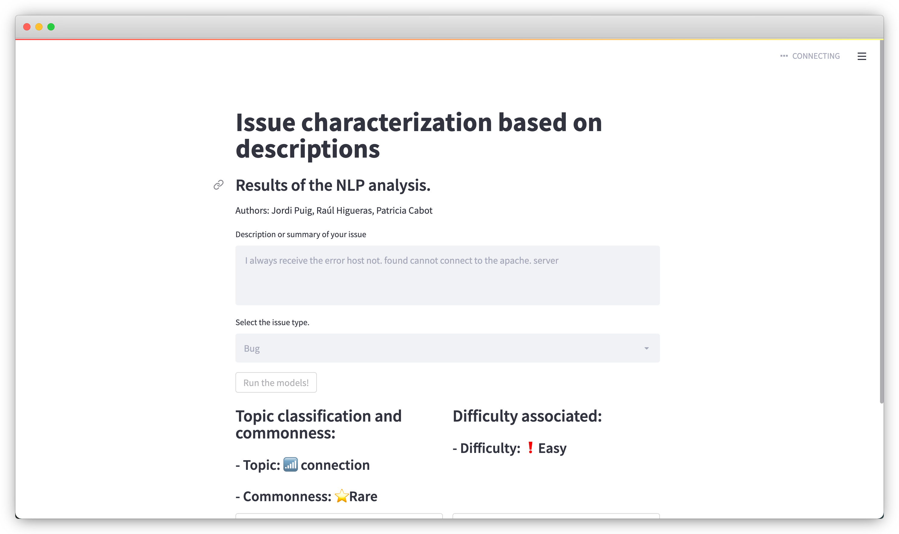

# tech-debt-NLP-analysis

Natural Language Processing analysis of developers' written messages in the Technical Debt Database to predict issues' difficulty.

## Table of Content

1. [Project Status](#project-status)
2. [Instructions of Use](#instructions-of-use)
3. [Project Organization](#project-organization)


## Project Status

- [x] Problem Understanding
- [x] Data Exploration 
- [x] Data Preprocessing
- [x] Modeling
- [x] Evaluation
- [x] Deploy

All finished! 😊


## Instructions of use

### Setup
First of all, run the following commands to install all the requirements and download the dataset.
```{bash}
make requirements
make data
```

### Data Exploration
The data exploration part is all contained in the notebook `001-exploration.ipynb`. To see the whole analysis, just run the notebook from the start of the document.

> ❗️ Warning
>
> Make sure that the command `make data` was executed without errors before trying to run the notebook.

### Data Preprocessing 
The data to download the data also applies the first preprocessing steps. Those functions join both versions of the data and generate the preprocessed dataset used later on.

### Modeling
The first step of the modeling is to  generate the features. This could be done running the command:
```{bash}
make features
```
The process of computing the features is broadly explained in the notebook `002-preprocessing.ipynb`.

Then, to train the models, run:
```{bash}
make models
```
The multiple models tested along with the results can be found in the following notebooks: 

- Topic modeling: `003-topicmodels.ipynb`.
- Regression: `004-regression.ipynb`.
- Classification: `005-classification.ipynb`.


### Evaluation 
The evaluation of the trained models can be found in their respectives notebooks.

### Deploy



After training the models (`make models`), the demo script can be executed with the following command:
```{bash}
make deploy
```
That will open a tab in an internet browser. Using Google Chrome is recommended.


## Project Organization
------------

    ├── LICENSE
    ├── Makefile           
    ├── README.md          
    ├── data
    │   ├── external       <- Data from third party sources.
    │   ├── interim        <- Intermediate data that has been transformed.
    │   ├── processed      <- The final, canonical data sets for modeling.
    │   └── raw            <- The original, immutable data dump.
    │
    ├── models             <- Trained and serialized models, model predictions, or model summaries
    │
    ├── notebooks          <- Jupyter notebooks.
    │
    ├── references         <- Data dictionaries, manuals, and all other explanatory materials.
    │
    ├── reports            <- Generated analysis as HTML, PDF, LaTeX, etc.
    │   └── figures        <- Generated graphics and figures to be used in reporting
    │
    ├── requirements.txt   <- The requirements file for reproducing the analysis environment
    │
    ├── setup.py           <- makes project pip installable (pip install -e .) so src can be imported
    ├── src                <- Source code for use in this project.
    │   ├── __init__.py    <- Makes src a Python module
    │   │
    │   ├── data           <- Scripts to download or generate data
    │   │   └── make_dataset.py
    │   │
    │   ├── features       <- Scripts to turn raw data into features for modeling
    │   │   └── build_features.py
    │   │
    │   ├── models         <- Scripts to train models and then use trained models to make
    │   │   │                 predictions
    │   │   ├── predict_model.py
    │   │   └── train_model.py
    │   │
    │   └── visualization  <- Scripts to create exploratory and results oriented visualizations
    │       └── visualize.py
    │
    └── tox.ini            <- tox file with settings for running tox; see tox.readthedocs.io


--------

<p><small>Project based on the <a target="_blank" href="https://drivendata.github.io/cookiecutter-data-science/">cookiecutter data science project template</a>. #cookiecutterdatascience</small></p>
